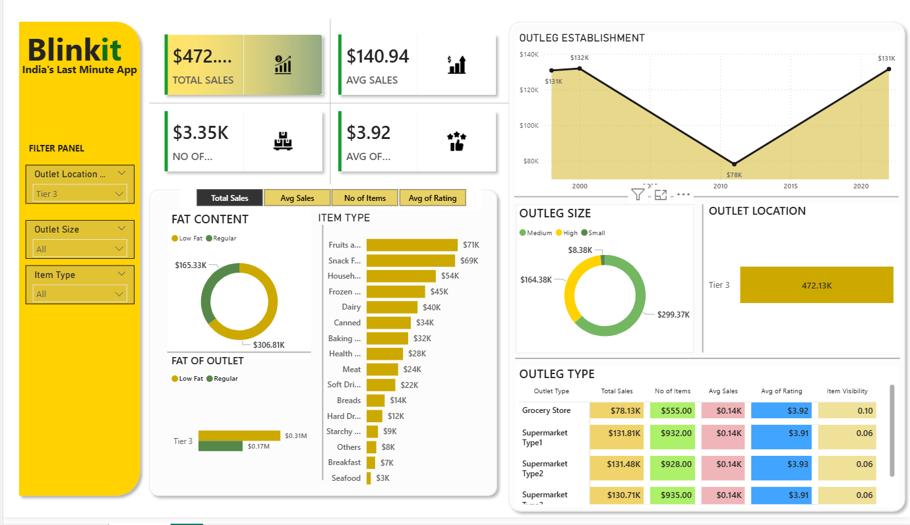

# Blinkit Analysis Project

## Project Overview
The **Blinkit Analysis** project focuses on analyzing Blinkit's sales performance, customer satisfaction, and inventory distribution. The goal is to identify key insights and opportunities for optimization using various KPIs and visualizations in **Power BI**.

## Business Requirements
- Conduct a comprehensive analysis of Blinkit's sales, customer ratings, and inventory.
- Identify patterns and trends to optimize sales and customer satisfaction.
- Use KPIs and visualizations to provide actionable insights.

## KPIs Used
- **Total Sales**: Overall revenue generated from all items sold.
- **Average Sales**: Average revenue per sale.
- **Number of Items**: Total count of different items sold.
- **Average Rating**: Average customer rating for items sold.

## Granular Analysis Requirements
1. **Total Sales by Fat Content**  
   - Objective: Analyze how fat content affects total sales.  
   - Metrics: Total Sales, Average Sales, Number of Items, Average Rating.

2. **Total Sales by Item Type**  
   - Objective: Identify performance of different item types.  
   - Metrics: Total Sales, Average Sales, Number of Items, Average Rating.

3. **Fat Content by Outlet for Total Sales**  
   - Objective: Compare sales across outlets segmented by fat content.  
   - Metrics: Total Sales, Average Sales, Number of Items, Average Rating.

4. **Total Sales by Outlet Establishment**  
   - Objective: Evaluate how outlet age or type influences sales.

## Charts & Visualizations
- **Percentage of Sales by Outlet Size**: Correlation between outlet size and total sales.
- **Sales by Outlet Location**: Geographic distribution of sales.
- **All Metrics by Outlet Type**: Comprehensive view of Total Sales, Average Sales, Number of Items, and Average Rating by outlet type.

## Dashboard
The main **Power BI dashboard** provides a consolidated view of all KPIs and insights.  
Below are placeholders for screenshots of the dashboard (replace with actual images from your Power BI project):

### Screenshot 1

## Tools Used
- **Power BI**: For data visualization and analysis.
